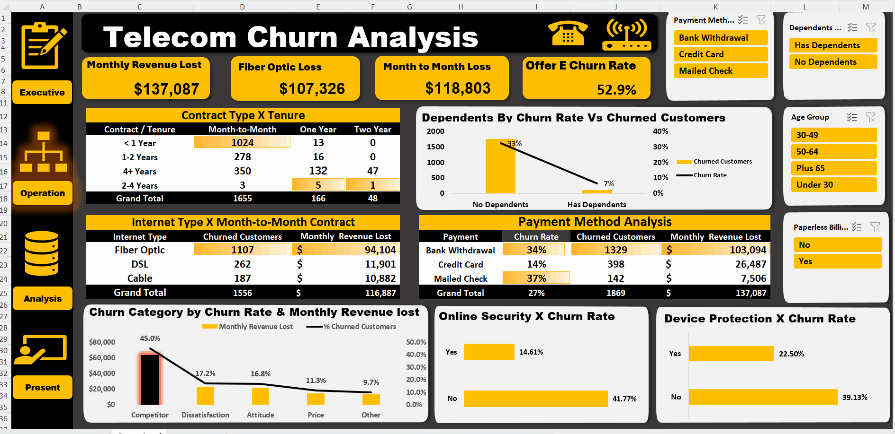

# 📞 Telecom Customer Churn Analysis


**Business Impact:** Identified $137K in monthly revenue loss from 1,869 churned customers (26.54% churn rate)

**Tools:** Excel • Power Pivot • DAX • Interactive Dashboards • Cohort Analysis

---

## 🎯 Dashboard Preview

### Executive Dashboard


### Operational Dashboard


---

## 📊 The Problem

A telecommunications company is losing **$137,087 per month** in recurring revenue due to customer churn. With 1,869 customers churning (26.54% churn rate), the company needs to understand which segments are at highest risk and why customers are leaving.

**Business Question:** Which customer segments should we prioritize to reduce churn and maximize revenue retention?

---

## 💡 Key Insights Discovered

### Financial Impact Breakdown

| Revenue Metric | Amount | Insight |
|----------------|--------|---------|
| **Total Monthly Loss** | $137K | Revenue at risk from churned customers |
| **Month-to-Month Losses** | $119K | 89% of total churn revenue |
| **Fiber Optic Losses** | $107K | Single largest service-based loss |

### High-Risk Customer Segments

| Customer Segment | Churn Rate | Revenue Impact | Key Finding |
|------------------|------------|----------------|-------------|
| **Fiber Optic Users** | 40.72% | $107K/month | 2x higher than DSL (18.58%) - service quality issue suspected |
| **Month-to-Month Contracts** | 26.54% | $119K/month | 89% of total churn revenue - contract type is primary driver |
| **Tenure < 1 Year** | 47% | High | Nearly half of new customers leave - onboarding problem |
| **No Dependents** | 33% | Medium | 5x higher than customers with families (7%) |
| **Mailed Check Payment** | 37% | $45K/month | 2.6x higher than Credit Card (14%) - friction in payment |

### Top Churn Drivers (by Customer Feedback)

1. **Competition** → 45% of churned customers (better offers elsewhere)
2. **Dissatisfaction** → 17% of churned customers (service quality issues)
3. **Attitude** → 17% of churned customers (poor customer service experience)
4. **Price** → 11% of churned customers (too expensive)

---

## 🎯 Business Impact & Recommendations

### 1. Contract Strategy - Immediate Action Required
**Problem:** Month-to-Month contracts account for $119K in monthly losses (89% of total churn revenue)

**Recommendation:**  
Launch a "Lock-In Loyalty" campaign targeting Month-to-Month customers:
- Offer 15% discount for 1-year contract conversion
- Target customers in Months 3-6 (pre-churn window)
- Add perks: Free device upgrade or premium support

**Expected ROI:** If 20% of M2M customers convert → **$24K/month savings ($288K annually)**

---

### 2. Service Quality Investigation - Fiber Optic Crisis
**Problem:** Fiber Optic churn (40.72%) is critically high vs DSL (18.58%)

**Recommendation:**  
- Conduct immediate service quality audit for Fiber Optic infrastructure
- Survey churned Fiber customers about specific pain points
- Benchmark speeds/uptime against competitors
- Focus retention efforts on first-year Fiber customers (47% churn rate)

**Focus Area:** First 90 days - implement proactive support outreach

---

### 3. Payment Experience Optimization
**Problem:** Mailed Check users churn at 37% vs 14% for Credit Card users

**Recommendation:**  
- Offer $10/month autopay discount for electronic payment enrollment
- Improve billing communication (clearer invoices, payment reminders)
- Reduce payment friction with one-click payment portal

**Target:** Convert 30% of check users to electronic payment → **$13K/month savings**

---

### 4. Family-Focused Retention Strategy
**Problem:** Single customers churn at 33% vs 7% for customers with families

**Recommendation:**  
- Create bundled family plans with multi-device discounts
- Offer "Bring a Family Member" referral bonuses
- Develop household-focused promotions (streaming bundles, multi-line savings)

**Strategy:** Target single customers with dependent-friendly offers during renewal periods

---

## 🛠️ Technical Approach

<details>
<summary><b>📊 Click to View Full Technical Details</b></summary>

### Tools & Technologies Used
- **Excel 2019** (Power Pivot add-in enabled)
- **Power Pivot** for data modeling
- **DAX** for calculated measures and KPIs
- **Pivot Tables & Pivot Charts** for multi-dimensional analysis
- **Slicers** for interactive filtering

### Technical Implementation

**Data Model Architecture:**
- Designed star schema with Fact_Churn and Dimension tables
- Created relationships between Customer, Contract, Service, and Billing tables
- Implemented DAX measures for dynamic calculations

**Key DAX Measures Created:**
```dax
Monthly Revenue Loss = 
    CALCULATE(
        SUM(Customers[Monthly Charge]),
        Customers[Churn Status] = "Churned"
    )

Churn Rate = 
    DIVIDE(
        COUNTROWS(FILTER(Customers, Customers[Churn Status] = "Churned")),
        COUNTROWS(Customers),
        0
    ) * 100

Avg Customer Lifetime Value = 
    AVERAGE(Customers[Total Charges])
```

**Analysis Components:**
- **31 pivot tables** analyzing churn from multiple angles:
  - Demographics (Age, Gender, Dependents)
  - Contract details (Type, Tenure groups)
  - Service usage (Internet Type, Phone Service, Streaming)
  - Billing information (Payment Method, Monthly Charges)
  - Geographic analysis (Top 10 cities by churn)
  
- **Interactive slicers** for dynamic filtering:
  - Age Group, Gender, Dependents, Partner Status
  - Contract Type, Payment Method, Internet Service
  - Churn Category, Tenure Group

- **Dual-dashboard design:**
  - **Executive Dashboard:** High-level KPIs and financial impact
  - **Operational Dashboard:** Segment deep-dive and root cause analysis

**Skills Demonstrated:**
- Customer segmentation and cohort analysis
- Financial impact quantification ($137K revenue loss)
- Multi-dimensional data analysis with pivot tables
- Executive-level data visualization
- Root cause analysis (contract type vs service quality)
- Actionable insight generation with ROI projections

</details>

---

## 📈 Dataset Overview

**Data Source:** IBM Sample Telecom Dataset (publicly available for educational use)

**Dataset Details:**
- **7,043 customers** analyzed
- **1,869 churned customers** (26.54% churn rate)
- **33 attributes** including demographics, services, billing, and churn reason
- **Time Period:** Q4 2023 customer base snapshot

**Variables Analyzed:**
- Demographics: Age, Gender, Dependents, Partner Status
- Contract Details: Contract Type, Tenure, Payment Method
- Service Usage: Internet Type, Phone Service, Streaming Services
- Billing Info: Monthly Charges, Total Charges
- Churn Category: Competition, Dissatisfaction, Price, Attitude, Other

---

## 🔄 How to Explore This Analysis

### Option 1: Download and Interact
1. **Download the dashboard:**  
   Click on `Telecom_Churn_Project_FINAL.xlsx` in this repository

2. **Requirements:**  
   - Excel 2016+ (Windows or Mac)
   - Power Pivot add-in enabled (Data → Manage Data Model)
   
3. **Interactive Features:**
   - Use slicers to filter by Age Group, Payment Method, Contract Type
   - Toggle between Executive and Operational dashboard views
   - Hover over charts for detailed tooltips and insights
   - Drill down into specific customer segments

4. **Key Sheets to Explore:**
   - `Executive Dashboard` → High-level metrics and financial impact
   - `Operational Dashboard` → Segment deep-dive and churn drivers
   - `Data Model` → View relationships and DAX measures
   - `Pivot Tables` → Raw analysis tables for verification

### Option 2: View GIFs Above
See the dashboards in action with the animated previews at the top of this README.

---

## 🎬 Project Outcome

This analysis demonstrates three core competencies:

✅ **Root Cause Analysis**  
Identified contract type (not service quality) as the primary revenue driver - Month-to-Month contracts account for 89% of churn losses

✅ **Segment Prioritization**  
Applied 80/20 rule to focus efforts on $119K M2M revenue loss and $107K Fiber Optic losses

✅ **ROI Quantification**  
Every recommendation includes specific financial impact and expected savings:
- Contract conversion program: $288K annual savings
- Payment optimization: $156K annual savings
- Total potential recovery: $444K annually (24% reduction in churn losses)

**For Hiring Managers:** This project showcases the ability to build executive-ready dashboards that combine advanced Excel proficiency with strategic business thinking. It goes beyond reporting by quantifying financial impact and providing specific, data-driven recommendations that stakeholders can act on immediately.

---

## 🔗 Connect

**LinkedIn:** [linkedin.com/in/saleh-hossam](https://linkedin.com/in/saleh-hossam)  
**Portfolio:** [saleh-hossam.github.io](https://saleh-hossam.github.io)  
**Email:** salehhossam611@gmail.com

---

## 📁 Repository Structure

```
Telecom-Churn-Analysis/
├── README.md                          # This file
├── Telecom_Churn_Project_FINAL.xlsx   # Interactive Excel dashboard
└── assets/
    ├── Exective_telecom.gif          # Executive dashboard preview
    └── Operation_telecom_.gif        # Operational dashboard preview
```

---

## 📄 License

This project uses the IBM Sample Telecom Dataset, which is publicly available for educational and demonstration purposes.

---

*This project demonstrates the ability to build executive-ready dashboards that combine technical Excel proficiency with business thinking. The analysis goes beyond reporting by quantifying financial impact ($137K monthly loss identified) and providing specific, data-driven recommendations with ROI projections ($444K potential annual recovery).*
